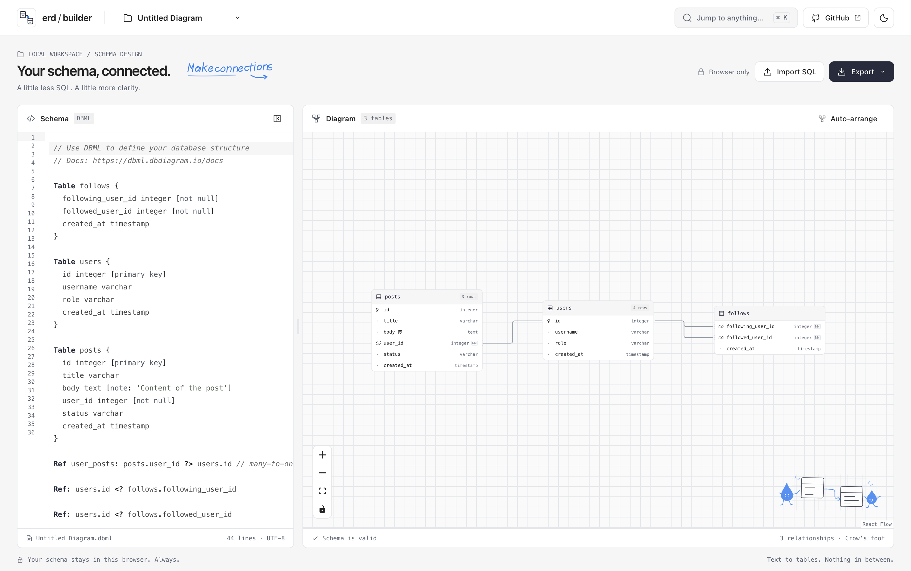

# ERD Builder

Text-first ERD visualizer for [DBML](https://dbml.dbdiagram.io/docs). Write a schema, get a live entity-relationship diagram with crow's-foot notation. Runs entirely in the browser — no account, no backend, no data leaves the tab.

**Live app:** [erd-builder.bangadam-dev.workers.dev](https://erd-builder.bangadam-dev.workers.dev/)

## Preview

[](https://erd-builder.bangadam-dev.workers.dev/)

The live workbench: edit DBML on the left and explore the generated relationship diagram on the right.

## Why

Diagram editors make you drag boxes. Schemas are text, they live in version control, and they are reviewed as diffs. ERD Builder keeps DBML as the single source of truth and treats the canvas as a pure render of it, so the picture can never drift from the definition.

## Features

- **Live diagram** — parse and re-render on a 300 ms debounce while typing.
- **Crow's-foot notation** — DBML's `?` optionality maps onto the hollow-circle glyph, so `0..1` and `1` stay visually distinct. `<>` renders dashed, since it has no physical foreign key.
- **Column-level edges** — relationships anchor to the exact field row, not the box edge.
- **Context-aware autocomplete** — block keywords at top level, column types after a name, settings inside `[…]`, and column names after `table.`.
- **Stable layout** — new tables are placed by [dagre](https://github.com/dagrejs/dagre); tables you have dragged keep their coordinates, so adding a column never reshuffles the canvas.
- **Inline diagnostics** — parse errors squiggle at the offending token; the last valid diagram stays on screen instead of blanking.
- **Cross-highlight** — click a table to jump the editor to its block; move the cursor into a block to highlight the node.
- **Export** — `.dbml`, PostgreSQL, MySQL, and SQL Server DDL.
- **Light and dark themes** — driven by CSS custom properties; `[headercolor: #hex]` is honoured.
- **SQL import** — paste or drop a `.sql` file, choose a dialect, and preview the DBML before creating, replacing, or appending a document.
- **Local document library** — create, rename, duplicate, and delete diagrams stored in this browser.
- **Command palette** — find tables, columns, documents, and actions with `Cmd+K` or `Ctrl+K`.
- **Schema inspector** — read column details, indexes, enum values, relationships, and up to 100 sample rows.
- **Composite foreign keys** — one edge per column pair, with cardinality markers on the first pair only.

## Getting started

```bash
npm install
npm run dev
```

The app is client-only; `npm run build` emits a static bundle that can be hosted anywhere.

## Deployment

Production runs on **Cloudflare Workers Static Assets**:

https://erd-builder.bangadam-dev.workers.dev/

The initial Wrangler setup deployed this frontend to Workers rather than a Pages project. The application remains browser-only: there is no database or application API on the server.

To deploy from this repository with an account that has access to the Worker:

```bash
npx wrangler login
npm run deploy
```

`npm run deploy` runs the production build and then `wrangler deploy`. The Cloudflare Vite plugin writes the asset deployment configuration, and `wrangler.jsonc` enables the single-page application fallback. Use Node.js `20.19+` or `22.12+`.

Deployment is currently manual; pushing to GitHub does not automatically publish a new version.

## Scripts

| Command | Description |
| --- | --- |
| `npm run dev` | Vite dev server |
| `npm run build` | Type-check and build for production |
| `npm run lint` | oxlint |
| `npm run smoke` | Parsing, layout, completion, storage, SQL import, and worker race regressions |
| `npm run deploy` | Build and publish to the configured Cloudflare Worker |

## Architecture

```
src/
├─ lib/
│  ├─ schema.ts         internal model — no vendor types
│  ├─ parseDbml.ts      DBML parser adapter
│  ├─ layout.ts         dagre placement + position merging
│  ├─ dbmlLanguage.ts   CodeMirror syntax highlighting
│  ├─ dbmlComplete.ts   context-aware completion sources
│  ├─ sqlOptions.ts     lightweight dialect metadata and detection
│  ├─ importSql.ts      worker-side SQL-to-DBML conversion
│  ├─ exportSchema.ts   browser download with off-thread SQL conversion
│  ├─ schema.worker.ts parser/import/export worker
│  ├─ schemaWorkerClient.ts correlated worker requests
│  └─ storage.ts        localStorage persistence, cross-tab detection
├─ store/useStore.ts    Zustand state
└─ components/          Editor, canvas, document menu, import dialog, palette, inspector
```

Key design decisions:

**The parser is isolated.** `parseDbml.ts` translates the vendor parser's output into the model in `schema.ts`. SQL import and export have separate adapters. Components do not depend directly on vendor shapes such as circular references and endpoint objects.

**Positions live outside the parse.** DBML carries no coordinates, so `positions` is stored separately and keyed by qualified table name. Layout only runs for tables it has not seen, which is what keeps the canvas still while you type.

**Node size is computed, never measured.** Table height is `header + columns × row`, derived from schema data. Reading it back from the DOM would only be available after paint and would flicker the diagram on every parse.

**Parsing stays off the UI thread.** The full `@dbml/core` bundle runs in a dedicated Web Worker. The editor and application shell render without waiting for it; the diagram appears only after a real parse succeeds. Request IDs plus per-document revisions prevent late results from overwriting newer edits. The vendor bundle is still downloaded—worker isolation improves responsiveness, not the total parser download size.

The workbench follows `DESIGN.md`: paper surfaces, graph-paper canvas, monochrome controls, and compact outlined tables. Original model-authored SVG illustrations live in `public/art/`; no external image service or remote font is required.

## Stack

React 19 · TypeScript · Vite · Tailwind CSS v4 · [React Flow](https://reactflow.dev) · [CodeMirror 6](https://codemirror.net) · [Zustand](https://zustand.docs.pmnd.rs) · [`@dbml/core`](https://www.npmjs.com/package/@dbml/core) · [dagre](https://github.com/dagrejs/dagre)

The [ReUI](https://reui.io) shadcn registry is configured in `components.json`; the current application components are implemented locally.

## Limitations

- Desktop only — a split editor and canvas are not usable at phone widths.
- The canvas renders the schema but does not edit it. Changes are made in DBML.
- Sample `Records` appear in the inspector (first 100 rows); SQL export does not emit them as `INSERT` statements.
- Browser storage is local to each origin and browser. Clearing site data removes local documents; export DBML files for backups.

## License

MIT
